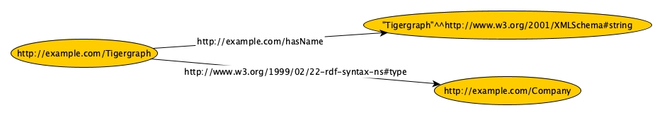
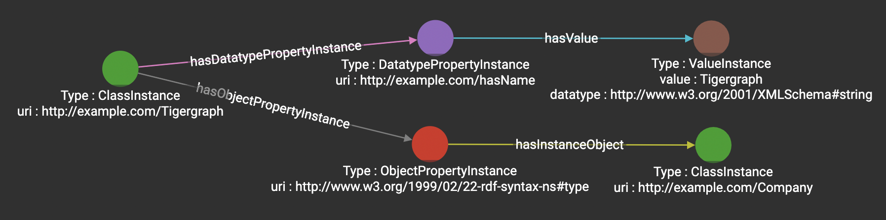

# Towards Migrating RDF Knolwedge Graphs to Proerty Graphs in TigerGraph

## Reproducibility
Run the ipynb file in Jupyter Notebook or run the python code directly 

## Data Sources
[LDBC Semantic Publishing Benchmark](https://ldbcouncil.org/benchmarks/spb/)

## Dependencies
rdflib, pytigergraph, pandas, hashlib, csv

## Graph Model Mapping
Mapping Rules and examples from RDF graphs to Tigergraph
```
@prefix rdf: <http://www.w3.org/1999/02/22-rdf-syntax-ns#> 
@prefix ex: <http://example.com/> 
@prefix xsd: <http://www.w3.org/2001/XMLSchema#>

ex:Tigergraph rdf:type ex:Company .
ex:Tigergraph ex:hasName "Tigergraph"^^xsd:string .
```
| Mapping Rules | RDF Graphs | TigerGraph | Examples |
| Rule 1 | Subject | ClassInstance | ex:Tigergraph |
| Rule 2 | Predicate (Object Property) | ObjectPropertyInstance | rdf:type |
| Rule 3 | Predicate (Datatype Property) | DatatypePropertyInstance | ex:hasName |
| Rule 4 | Object (!isLiteral) | ClassInstance | ex:Company |
| Rule 5 | Object (isLiteral) | ValueInstance | "Tigergraph"^^xsd:string |
| Rule 6 | Literal Value | ValueInstance's attribute: value | Tigergraph |
| Rule 7 | Datatype | ValueInstance's attribute: datatype | xsd:string |

## Schema Diagram





## Contributers
```
Lu Zhou
Research Engineer

Jay Yu 
VP of Product and Innovation

TigerGraph, Inc.
```
