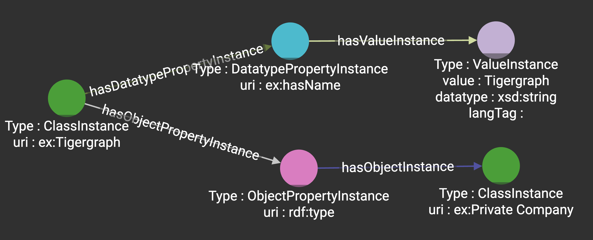
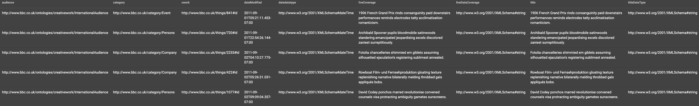

# Towards Migrating RDF Knolwedge Graphs to Property Graphs in TigerGraph
Both RDF and property graph models provide ways to explore and graphically depict connected data. But the two graph models are very different, while each has different strengths in different use cases. RDF is a standard model for data interchange on the Web. RDF has features that facilitate data integration even if the underlying schemas of data sources are different. With the support of RDF Schema (RDFS) and Web Ontology Language (OWL), it enables the inference engine to discover more implicit knowledge in the graph. In contrast, property graphs were developed about efficient storage that would allow for fast querying and traversals across connected data. However, once after choosing one graph model, it is not convenient to losslessly transfer it to another one due to different reasons, e.g, time and cost consumption, technical challenges in converting between two graph models, and different query languages. To provide solutions to customers wanting to migrate their existing RDF graph models to property graph models, we propose a method to migrate [LBDC Semantic Publishing RDF Benchmark (SPB)](https://ldbcouncil.org/benchmarks/spb/) to property graphs using TigerGraph. In addition to mapping about 32 million triples, we also translate 36 SPARQL queries to GSQL, which is the query language used in the TigerGraph database, with an initial analysis of query performance.

## Reproducibility
* LDBC SPB benchmark generator instruction

	Please see details in [SPB sepecification](https://ldbcouncil.org/benchmarks/spb/ldbc-spb-v2.0-specification.pdf)

* Create Schema, Map data, Load CSV file, Run queries, Evaluate performance

	Run the ipynb file in Jupyter Notebook or run the python code directly 

## Data Sources
[LDBC Semantic Publishing Benchmark](https://ldbcouncil.org/benchmarks/spb/)

## Dependencies
rdflib, pytigergraph, pandas, hashlib, csv

## Graph Model Mapping
Mapping Rules and examples from RDF graphs to Tigergraph
```
@prefix rdf: <http://www.w3.org/1999/02/22-rdf-syntax-ns#> 
@prefix ex: <http://example.com/> 
@prefix xsd: <http://www.w3.org/2001/XMLSchema#>

ex:Tigergraph rdf:type ex:Company .
ex:Tigergraph ex:hasName "Tigergraph"^^xsd:string .
```
| Mapping Rules | RDF Graphs | TigerGraph | Examples |
|:---:|:---:|:---:|:---:|
| Rule 1 | Subject | ClassInstance | ex:Tigergraph |
| Rule 2 | Predicate (Object Property) | ObjectPropertyInstance | rdf:type |
| Rule 3 | Predicate (Datatype Property) | DatatypePropertyInstance | ex:hasName |
| Rule 4 | Object (!isLiteral) | ClassInstance | ex:Company |
| Rule 5 | Object (isLiteral) | ValueInstance | "Tigergraph"^^xsd:string |
| Rule 6 | Literal Value | ValueInstance's attribute: value | Tigergraph |
| Rule 7 | Datatype | ValueInstance's attribute: datatype | xsd:string |

## Example Graphs in Diagram


*Figure 1. Example triples in RDF Graph*


*Figure 2. Example triples in Tigergraph*

## SPARQL to GSQL Translation
Example query:
```
Retrieve properties dateModified, title, category, liveCoverage, audience for all 
creative works that are of a given type. The value of property dateModified of the 
retrieved creative works should be within a certain time range. Return 5 results 
ordered in ascending order by their dateModified.
```


*Figure 3. SPARQL query*


*Figure 4. Results returned by running SPARQL query*


*Figure 5. GSQL query*


*Figure 6. Results returned by running GSQL query*

## Contributers
```
Lu Zhou
Research Engineer
Jay Yu 
VP of Product and Innovation
TigerGraph, Inc.
```
